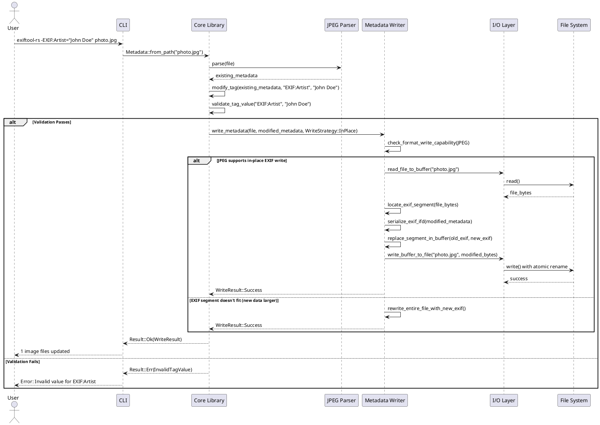

# Task Briefing Package

This package contains all necessary information and strategic guidance for the Coder Agent.

---

## 1. Current Task Details

This is the full specification of the task you must complete.

```json
{
  "task_id": "I3.T4",
  "iteration_id": "I3",
  "iteration_goal": "Implement metadata write operations with atomic file handling, extend TIFF parser for standalone TIFF files (not just EXIF in JPEG), implement metadata serialization, and add tag modification capabilities to CLI.",
  "description": "Implement write operation in src/core/operations.rs: write_metadata(path: &Path, metadata: &MetadataMap) -> Result<()> that: (1) Validates all tag values using validation engine (I2.T10), (2) Reads original file, (3) Detects format, (4) Serializes metadata using appropriate writer (JPEG writer for JPEG, TIFF writer for TIFF), (5) Writes result using atomic_writer (I3.T1). Add modify_tag(path, tag_name, new_value) convenience function. Add integration tests for JPEG and error handling (invalid tag value).",
  "agent_type_hint": "BackendAgent",
  "inputs": "I2.T10 validation, I3.T1 atomic writer, I3.T3 JPEG writer",
  "target_files": [
    "src/core/operations.rs",
    "tests/integration/write_operations_tests.rs"
  ],
  "input_files": [
    "src/core/validation.rs",
    "src/writers/atomic_writer.rs",
    "src/writers/jpeg_writer.rs"
  ],
  "deliverables": "write_metadata() and modify_tag() functions, validation integration, integration tests",
  "acceptance_criteria": "write_metadata() validates tags before writing, returns InvalidTagValue error for validation failures, successfully writes modified JPEG with EXIF changes, uses atomic file operations (no corruption on crash), modify_tag() is a convenience wrapper around write_metadata(), integration tests verify successful write and validation errors, cargo test write_operations passes",
  "dependencies": [
    "I2.T10",
    "I3.T1",
    "I3.T3"
  ],
  "parallelizable": false,
  "done": false
}
```

---

## 2. Architectural & Planning Context

The following are the relevant sections from the architecture and plan documents, which I found by analyzing the task description.

### Context: alternative-flow-metadata-write (from 04_Behavior_and_Communication.md)

```markdown
#### Alternative Flow: Metadata Write Operation

**Description**: Sequence for **modifying metadata and writing back to file**.

**Diagram (PlantUML)**:



**Key Design Decisions**:

1. **Read-Modify-Write**: Always read existing metadata first to preserve unmodified tags
2. **In-Place vs. Rewrite**: Attempt in-place modification if new metadata fits in existing segment; otherwise rewrite entire file
3. **Atomic Write**: Use temporary file + atomic rename to prevent corruption on crash
4. **Validation Before Write**: Validate tag values against type constraints before any file modification
```

### Context: task-i3-t4 (from 02_Iteration_I3.md)

```markdown
*   **Task 3.4: Implement Metadata Write Operation**
    *   **Task ID:** `I3.T4`
    *   **Description:** Implement write operation in `src/core/operations.rs`: `write_metadata(path: &Path, metadata: &MetadataMap) -> Result<()>` that: (1) Validates all tag values using validation engine (I2.T10), (2) Reads original file, (3) Detects format, (4) Serializes metadata using appropriate writer (JPEG writer for JPEG, TIFF writer for TIFF), (5) Writes result using atomic_writer (I3.T1). Add `modify_tag(path, tag_name, new_value)` convenience function. Add integration tests for JPEG and error handling (invalid tag value).
    *   **Agent Type Hint:** `BackendAgent`
    *   **Inputs:** I2.T10 validation, I3.T1 atomic writer, I3.T3 JPEG writer
    *   **Input Files:** [`src/core/validation.rs`, `src/writers/atomic_writer.rs`, `src/writers/jpeg_writer.rs`]
    *   **Target Files:**
        *   `src/core/operations.rs` (add write functions)
        *   `tests/integration/write_operations_tests.rs`
    *   **Deliverables:**
        *   write_metadata() and modify_tag() functions
        *   Validation integration
        *   Integration tests
    *   **Acceptance Criteria:**
        *   write_metadata() validates tags before writing
        *   Returns InvalidTagValue error for validation failures
        *   Successfully writes modified JPEG with EXIF changes
        *   Uses atomic file operations (no corruption on crash)
        *   modify_tag() is a convenience wrapper around write_metadata()
        *   Integration tests verify successful write and validation errors
        *   `cargo test write_operations` passes
    *   **Dependencies:** `I2.T10`, `I3.T1`, `I3.T3`
    *   **Parallelizable:** No (depends on multiple I3 tasks)
```

### Context: security-considerations (from 05_Operational_Architecture.md)

```markdown
#### Security Considerations

**Threat Model**:

ExifTool-RS processes potentially malicious files from untrusted sources (e.g., user uploads, scraped images). Primary threats:

1. **Memory Corruption**: Buffer overflows, use-after-free in parsers
2. **Resource Exhaustion**: Zip bombs, billion laughs (XML), decompression bombs
3. **Path Traversal**: Malicious filenames in archive processing
4. **Code Injection**: Via scripting features (if added)

**Mitigations**:

| **Threat** | **Mitigation** | **Implementation** |
|------------|---------------|-------------------|
| Buffer overflows | Rust ownership system | Compile-time prevention via borrow checker |
| Integer overflows | Checked arithmetic | `#![deny(overflowing_literals)]`, `checked_add()` in parsers |
| Resource exhaustion | Size limits | Max allocation: 1GB per file, max parse depth: 64 levels (nested IFDs) |
| Zip bombs | Decompression ratio check | Reject if uncompressed > 100x compressed size |
| XXE attacks (XML) | Disable external entities | `quick-xml` configured to reject DOCTYPE, external entities |
| Path traversal | Path sanitization | `canonicalize()` + jail to working directory for batch operations |
| Dependency vulnerabilities | Automated scanning | `cargo-audit` in CI, Dependabot alerts, minimal dependency tree |
| Malicious input | Fuzzing | Continuous fuzzing with `cargo-fuzz`, OSS-Fuzz integration target |

**Input Validation**:

All parsers follow defensive pattern:
```rust
fn read_u32_at(data: &[u8], offset: usize) -> Result<u32> {
    let bytes = data.get(offset..offset+4)
        .ok_or(ParseError::UnexpectedEof)?;  // Bounds check
    Ok(u32::from_le_bytes(bytes.try_into().unwrap()))
}
```

**Secure Defaults**:

- No script execution (unlike Perl ExifTool's `-execute` feature)
- No network access by default (geolocation requires opt-in `--geolocation` flag)
- Read-only mode available via `--readonly` flag (prevents accidental writes)
```

---

## 3. Codebase Analysis & Strategic Guidance

The following analysis is based on my direct review of the current codebase. Use these notes and tips to guide your implementation.

### Relevant Existing Code

*   **File:** `src/core/operations.rs`
    *   **Summary:** This file contains the core `read_metadata()` orchestration function and parsing logic for JPEG and TIFF formats. It demonstrates the pattern of: (1) opening with MMapReader, (2) format detection, (3) routing to appropriate parser. Currently has only READ operations - you will ADD write operations here.
    *   **Recommendation:** You MUST follow the same orchestration pattern for `write_metadata()`. The function already imports `MMapReader`, `detect_format`, and parsers. You MUST add imports for validation, atomic writer, and JPEG writer. Look at the existing `parse_jpeg_metadata()` pattern as a reference for handling different formats.
    *   **Critical Detail:** The file uses helper functions `tag_id_to_name()` and `raw_bytes_to_tag_value()`. Note the current implementation of `read_metadata()` does NOT use the tag registry for validation - it just extracts raw data. Your write operation MUST integrate validation from `src/core/validation.rs`.

*   **File:** `src/core/validation.rs`
    *   **Summary:** This file provides the `validate_tag_value(descriptor: &TagDescriptor, value: &TagValue) -> Result<()>` function that performs comprehensive type checking.
    *   **Recommendation:** You MUST call this validation function for EVERY tag in the MetadataMap before writing. The function is already fully implemented with 20+ test cases. Import it and use it in a loop over all metadata tags.
    *   **Critical Detail:** Validation requires a `TagDescriptor` object. You will need to look up each tag in the tag registry (see `src/tag_db/tag_registry.rs`) to get its descriptor. The registry uses a static `TAG_REGISTRY: Lazy<HashMap<&'static str, TagDescriptor>>` with a `get_tag_descriptor(name: &str)` function.

*   **File:** `src/writers/atomic_writer.rs`
    *   **Summary:** Provides `write_atomic(path: &Path, data: &[u8]) -> Result<()>` which implements the temp-file-and-rename pattern with fsync guarantees.
    *   **Recommendation:** You MUST use this function as the FINAL step of your write operation. After you serialize the metadata into bytes, call `write_atomic(path, &bytes)` to safely write to disk. This ensures atomicity - no partial writes even on crash.
    *   **Critical Detail:** This function is already fully implemented and tested with 10+ test cases. You do NOT need to modify it - just import and use it.

*   **File:** `src/writers/jpeg_writer.rs`
    *   **Summary:** Provides `write_exif_to_jpeg(reader: &dyn FileReader, metadata: &MetadataMap) -> Result<Vec<u8>>` which returns the complete modified JPEG as bytes.
    *   **Recommendation:** You MUST use this function for JPEG files. It handles all the complexity of parsing segments, serializing EXIF, and reconstructing the JPEG structure. Call it with a FileReader and MetadataMap, then pass the returned bytes to `atomic_writer`.
    *   **Critical Detail:** This function only processes tags with "EXIF:" prefix. It's already fully implemented with 15+ test cases. You do NOT need to modify it - just call it.

*   **File:** `src/tag_db/tag_registry.rs`
    *   **Summary:** Contains a static registry with 100 TagDescriptor entries using lazy initialization. The main entry point is `get_tag_descriptor(name: &str) -> Option<&TagDescriptor>`.
    *   **Recommendation:** You SHOULD import and use `get_tag_descriptor()` to look up tag descriptors for validation. If a tag is not in the registry, you SHOULD skip validation for that tag (or log a warning) and proceed with the write.
    *   **Implementation Note:** The current registry only has 100 tags. User-defined or rare tags may not be present. Your validation loop should handle `None` results gracefully.

*   **File:** `src/core/metadata_map.rs`
    *   **Summary:** Core data structure storing metadata as `HashMap<String, TagValue>`. Has methods like `get()`, `get_mut()`, `insert()`, `iter()`.
    *   **Recommendation:** You MUST iterate over all tags in the MetadataMap to validate them. Use `metadata.iter()` which returns an iterator of `(&String, &TagValue)` pairs. Each tag name and value should be validated before proceeding with write.

### Implementation Tips & Notes

*   **Tip:** The validation step MUST happen BEFORE any file I/O operations. If validation fails for ANY tag, return the error immediately and do NOT proceed with reading or writing the file. This prevents corrupting files with invalid data.

*   **Tip:** For `modify_tag()`, you MUST first call `read_metadata()` to get the existing metadata, then modify the single tag, then call `write_metadata()` with the modified map. This ensures all other tags are preserved. The architecture diagram shows this "Read-Modify-Write" pattern explicitly.

*   **Note:** The current code in `operations.rs` only supports JPEG and TIFF formats. Your `write_metadata()` function MUST check the detected format and route to the appropriate writer. For now, only JPEG write is implemented (I3.T3 completed), so you SHOULD return `UnsupportedFormat` error for TIFF or other formats (TIFF writer comes in I3.T7).

*   **Note:** Error handling is critical. The architecture specifies that ALL errors should propagate via `Result<T, ExifToolError>`. The `?` operator should be used throughout. The validation function already returns `ExifToolError::InvalidTagValue`, and the atomic writer converts `io::Error` to `ExifToolError` automatically.

*   **Warning:** The task description says to add integration tests in `tests/integration/write_operations_tests.rs`, which is a NEW file. You MUST create this file. The tests should use the same pattern as `tests/integration/jpeg_tests.rs` (which already exists from I1.T14). Test both successful write scenarios AND validation failure scenarios.

*   **Critical:** When calling `write_exif_to_jpeg()`, you need to pass a `FileReader`. You MUST open the file with `MMapReader` or `BufferedReader` first. The JPEG writer reads the original file to preserve non-EXIF segments, then returns complete modified bytes.

*   **Best Practice:** The architecture emphasizes defensive programming and bounds checking. Even though all input files are validated, always use `.ok_or()` or `.ok_or_else()` when dealing with `Option` types to convert to proper error types rather than `.unwrap()`.

*   **Integration Test Structure:** Your test file MUST follow this pattern:
    1. Create a sample JPEG file (or use one from `tests/fixtures/jpeg/`)
    2. Call `modify_tag()` to change a tag value
    3. Re-read the file using `read_metadata()`
    4. Assert the tag value changed
    5. Test validation failure by trying to write an invalid tag value (e.g., String where Integer is expected)

### Workflow Summary

Your implementation workflow should be:

1. **Add imports** to `src/core/operations.rs`: validation, atomic_writer, jpeg_writer, tag_registry
2. **Implement `write_metadata()`**:
   - Step 1: Validate ALL tags by looking them up in registry and calling `validate_tag_value()`
   - Step 2: Open file with `MMapReader` (reuse existing code pattern)
   - Step 3: Detect format using `detect_format()` (already in file)
   - Step 4: Match on format and call appropriate writer (only JPEG for now)
   - Step 5: Get serialized bytes from writer
   - Step 6: Write atomically using `write_atomic(path, &bytes)`
3. **Implement `modify_tag()`**:
   - Call `read_metadata(path)` to get existing metadata
   - Modify the single tag using `metadata.insert(tag_name, new_value)`
   - Call `write_metadata(path, &metadata)`
4. **Create integration test file** `tests/integration/write_operations_tests.rs`
5. **Write tests**: successful write, validation failure, round-trip verification

All the heavy lifting (validation logic, atomic writing, JPEG serialization) is ALREADY DONE. You are orchestrating these components together.
