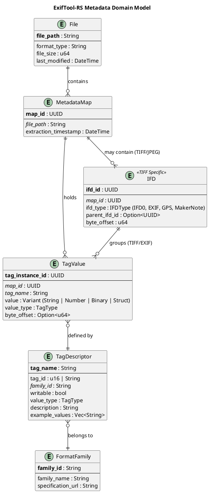

# Task Briefing Package

This package contains all necessary information and strategic guidance for the Coder Agent.

---

## 1. Current Task Details

This is the full specification of the task you must complete.

```json
{
  "task_id": "I1.T3",
  "iteration_id": "I1",
  "iteration_goal": "Establish project foundation with directory structure, build system, core domain models, architectural diagrams, and basic JPEG EXIF parsing capability to validate end-to-end workflow.",
  "description": "Create Mermaid ERD showing in-memory metadata data model: File, MetadataMap, TagValue, TagDescriptor, FormatFamily, IFD entities with relationships and key attributes. Save to docs/diagrams/metadata_erd.mmd. Include cardinalities (one-to-many, many-to-one).",
  "agent_type_hint": "DocumentationAgent",
  "inputs": "Section 2 (Data Model Overview), Section 2.1 (Key Architectural Artifacts), ERD specification from architecture blueprint",
  "target_files": ["docs/diagrams/metadata_erd.mmd"],
  "input_files": [".codemachine/artifacts/architecture/03_System_Structure_and_Data.md"],
  "deliverables": "Mermaid ERD file with all entities and relationships",
  "acceptance_criteria": "Mermaid file renders correctly (validate with Mermaid CLI or online editor), all entities from Section 2 Data Model Overview are present, relationships accurately reflect described cardinalities (File 1:N MetadataMap, etc.), primary keys and foreign keys are indicated",
  "dependencies": ["I1.T1"],
  "parallelizable": true,
  "done": false
}
```

---

## 2. Architectural & Planning Context

The following are the relevant sections from the architecture and plan documents, which I found by analyzing the task description.

### Context: data-model-overview (from 03_System_Structure_and_Data.md)

```markdown
<!-- anchor: data-model-overview -->
### 3.6. Data Model Overview & ERD

**Description**: ExifTool-RS operates on files without persistent database storage. The "data model" represents in-memory structures for metadata representation. The Entity-Relationship Diagram below models the logical relationships between metadata concepts.
```

### Context: key-entities (from 03_System_Structure_and_Data.md)

```markdown
<!-- anchor: key-entities -->
#### Key Entities

1. **File**: Represents a media file being processed (JPEG, PNG, etc.)
2. **MetadataMap**: Collection of all metadata tags extracted from a file
3. **TagValue**: A single metadata tag with its name, value, and type information
4. **TagDescriptor**: Definition of a tag (from tag database) including ID, name, type constraints, format family
5. **FormatFamily**: Grouping of related metadata standards (EXIF, XMP, IPTC, MakerNotes)
6. **IFD (Image File Directory)**: TIFF-specific structural element containing tags

**Diagram (PlantUML - Metadata ERD)**:



**Rationale**:

- **No Persistent Database**: The system is stateless. `MetadataMap` exists only in-memory during processing and is serialized to JSON/text output or written back to file metadata.

- **Variant Value Type**: `TagValue.value` uses a Rust `enum` to represent heterogeneous tag types:
  ```rust
  enum TagValueData {
      String(String),
      Number(f64),
      Integer(i64),
      Binary(Vec<u8>),
      Rational { numerator: i32, denominator: i32 },
      Struct(HashMap<String, TagValueData>), // For complex XMP structures
  }
  ```

- **IFD Hierarchy**: TIFF/EXIF formats use nested IFD structures. The self-referential `parent_ifd_id` models this (e.g., GPS sub-IFD under IFD0).

- **Tag Descriptor**: Compile-time generated from ExifTool tag database. In practice, this is a large static `HashMap<&'static str, TagDescriptor>` embedded in the binary, not a runtime database.
```

### Context: artifact-erd (from 01_Plan_Overview_and_Setup.md)

```markdown
<!-- anchor: artifact-erd -->
*   **Entity Relationship Diagram (Mermaid)**
    *   **Purpose:** Define in-memory data structures and relationships between metadata entities
    *   **Format:** Mermaid ERD
    *   **Location:** `docs/diagrams/metadata_erd.mmd`
    *   **Created In:** Iteration 1, Task 3
    *   **Content:** File, MetadataMap, TagValue, TagDescriptor, FormatFamily, IFD entities with relationships
```

### Context: data-model-overview (from 01_Plan_Overview_and_Setup.md)

```markdown
<!-- anchor: data-model-overview -->
*   **Data Model Overview:**
    *   **File:** Represents media file being processed (path, format, size)
    *   **MetadataMap:** Collection of all tags extracted from a file
    *   **TagValue:** Single metadata tag with name, value, type information, and optional byte offset
    *   **TagDescriptor:** Tag definition from database (ID, name, type constraints, format family)
    *   **FormatFamily:** Grouping of metadata standards (EXIF, XMP, IPTC, MakerNotes)
    *   **IFD (Image File Directory):** TIFF-specific structural element for tag organization

    *See ERD (Section 2.1, Iteration 1, Task 3)*

    **Note:** No persistent database storage. All data structures are in-memory during processing, serialized to JSON/text output or written back to file metadata.
```

### Context: task-i1-t3 (from 02_Iteration_I1.md)

```markdown
<!-- anchor: task-i1-t3 -->
*   **Task 1.3: Generate Entity Relationship Diagram (ERD)**
    *   **Task ID:** `I1.T3`
    *   **Description:** Create Mermaid ERD showing in-memory metadata data model: File, MetadataMap, TagValue, TagDescriptor, FormatFamily, IFD entities with relationships and key attributes. Save to `docs/diagrams/metadata_erd.mmd`. Include cardinalities (one-to-many, many-to-one).
    *   **Agent Type Hint:** `DocumentationAgent` or `DiagrammingAgent`
    *   **Inputs:** Section 2 (Data Model Overview), Section 2.1 (Key Architectural Artifacts), ERD specification from architecture blueprint
    *   **Input Files:** [`.codemachine/artifacts/architecture/03_System_Structure_and_Data.md`]
    *   **Target Files:**
        *   `docs/diagrams/metadata_erd.mmd`
    *   **Deliverables:**
        *   Mermaid ERD file with all entities and relationships
    *   **Acceptance Criteria:**
        *   Mermaid file renders correctly (validate with Mermaid CLI or online editor)
        *   All entities from Section 2 Data Model Overview are present
        *   Relationships accurately reflect described cardinalities (File 1:N MetadataMap, etc.)
        *   Primary keys and foreign keys are indicated
    *   **Dependencies:** `I1.T1`
    *   **Parallelizable:** Yes (can run concurrently with T2, T5, T6 after T1 completes)
```

---

## 3. Codebase Analysis & Strategic Guidance

The following analysis is based on my direct review of the current codebase. Use these notes and tips to guide your implementation.

### Relevant Existing Code

*   **File:** `docs/diagrams/component_architecture.puml`
    *   **Summary:** This is the PlantUML component diagram created in I1.T2. It demonstrates the project's diagram formatting conventions and shows the hexagonal architecture structure.
    *   **Recommendation:** You SHOULD follow a similar documentation style for the ERD. The existing diagram uses PlantUML's C4 conventions with clear component boundaries, proper layout directives (`LAYOUT_WITH_LEGEND()`), and well-structured relationship declarations. Your Mermaid ERD should maintain similar clarity and professional formatting.

*   **File:** `src/core/metadata_map.rs`
    *   **Summary:** This file is currently a stub with only module documentation. It will contain the MetadataMap struct implementation.
    *   **Note:** The file currently only has a doc comment and `#![allow(dead_code)]`. The ERD you create will serve as the design blueprint for implementing this struct in future tasks.

*   **File:** `src/core/tag_value.rs`
    *   **Summary:** This file is currently a stub for the TagValue enum that will represent different metadata value types.
    *   **Note:** Similar to metadata_map.rs, this is a placeholder. Your ERD should accurately represent the TagValue entity's attributes and relationships to guide future implementation.

*   **File:** `src/core/tag_descriptor.rs`
    *   **Summary:** This file is currently a stub for the TagDescriptor struct that will hold tag definitions.
    *   **Note:** Another placeholder file. The ERD will define the structure and relationships for this entity.

*   **File:** `.codemachine/artifacts/architecture/03_System_Structure_and_Data.md`
    *   **Summary:** This is the authoritative source for the data model specification. It contains the complete PlantUML ERD that defines all entities, attributes, and relationships.
    *   **Recommendation:** You MUST convert the PlantUML ERD found in this file to Mermaid syntax while preserving all entities, attributes, relationships, and cardinalities exactly as specified.

### Implementation Tips & Notes

*   **Tip:** The architecture document contains a **complete PlantUML ERD specification** starting at line 160. Your task is to translate this PlantUML diagram into Mermaid ERD syntax. This is primarily a syntax conversion task, not a design task.

*   **Tip:** Mermaid ERD syntax differs from PlantUML:
    - **Entities:** Use `ENTITY_NAME { type attribute "label" }` format
    - **Relationships:** Use notation like `ENTITY1 ||--o{ ENTITY2 : "relationship label"`
    - **Cardinalities:** Mermaid uses `||` (exactly one), `o|` (zero or one), `}o` (zero or many), `|{` (one or many)
    - **Primary Keys:** Can be indicated with `PK` attribute type or in comments
    - **Foreign Keys:** Can be indicated with `FK` attribute type or in comments

*   **Tip:** Key Mermaid relationship cardinality symbols:
    - `||--||` : One to exactly one
    - `||--o{` : One to zero or many
    - `}o--||` : Zero or many to exactly one
    - `||--o|` : One to zero or one

*   **Note:** The architecture document specifies these exact relationships that MUST be preserved in your Mermaid diagram:
    1. File ||--o{ MetadataMap : "contains"
    2. MetadataMap ||--o{ TagValue : "holds"
    3. TagValue }o--|| TagDescriptor : "defined by"
    4. TagDescriptor }o--|| FormatFamily : "belongs to"
    5. MetadataMap ||--o{ IFD : "may contain (TIFF/JPEG)"
    6. IFD ||--o{ TagValue : "groups (TIFF/EXIF)"

*   **Note:** All six entities MUST be present: File, MetadataMap, TagValue, TagDescriptor, FormatFamily, and IFD. The IFD entity has a special stereotype marker `<<TIFF Specific>>` that should be preserved in a Mermaid-appropriate way (possibly as a comment).

*   **Note:** The TagValue entity has a special attribute `value : Variant (String | Number | Binary | Struct)` that represents a Rust enum. Ensure this complexity is captured in the Mermaid diagram's attribute list.

*   **Tip:** The architecture document provides detailed rationale for the data model design, including:
    - No persistent database (in-memory only)
    - Variant value types for TagValue
    - IFD hierarchy with self-referential parent_ifd_id
    - Tag descriptors are compile-time generated

*   **Warning:** The acceptance criteria specifically state that the Mermaid file must render correctly. After creating the file, you SHOULD validate it using the Mermaid Live Editor (https://mermaid.live/) or Mermaid CLI if available. The diagram must be syntactically correct and visually clear.

*   **Warning:** The PlantUML ERD uses specific notation for primary and foreign keys:
    - `!define primary_key(x) <b>x</b>` (bold text)
    - `!define foreign_key(x) <i>x</i>` (italic text)

    In Mermaid, you'll need to use a different approach, such as:
    - Marking primary keys with `PK` type prefix
    - Marking foreign keys with `FK` type prefix
    - Or using comments like `%% PK` or `%% FK`

*   **Tip:** The project uses a professional, enterprise-grade documentation style. Your ERD should:
    - Include a clear title
    - Use consistent naming conventions
    - Have proper formatting and whitespace
    - Include helpful relationship labels
    - Be well-organized and easy to read

*   **Tip:** The existing `component_architecture.puml` file is 49 lines long with clear structure. Your Mermaid ERD should aim for similar clarity and completeness. Based on the PlantUML ERD in the architecture document (lines 160-228), expect your Mermaid version to be approximately 60-80 lines.

*   **Tip:** Mermaid ERD syntax uses the `erDiagram` directive at the start. A basic structure would be:
    ```mermaid
    erDiagram
        ENTITY_NAME {
            type attribute_name
            type attribute_name
        }
        ENTITY1 ||--o{ ENTITY2 : "relationship"
    ```

*   **Note:** For the IFD entity's self-referential relationship (parent_ifd_id), you should show this as an attribute but may also want to add a relationship line showing IFD relates to itself for parent/child hierarchy.

*   **Tip:** The PlantUML diagram uses `--` separators between the primary key and other attributes. In Mermaid, you can use comments to create visual separation or simply list attributes in logical order (PK first, then FKs, then regular attributes).

### Critical Success Factors

1. **Accuracy:** ALL six entities with their exact attributes from the architecture document
2. **Relationships:** ALL six relationships with correct cardinalities
3. **Syntax:** Valid Mermaid ERD syntax that renders without errors
4. **Keys:** Clear indication of primary keys and foreign keys
5. **Professional Quality:** Clean, well-formatted diagram suitable for enterprise documentation

### Data Type Mappings for Mermaid

Based on the PlantUML specification, here are the attribute types you should use:

*   **File:**
    - file_path: String (PK)
    - format_type: String
    - file_size: u64
    - last_modified: DateTime

*   **MetadataMap:**
    - map_id: UUID (PK)
    - file_path: String (FK)
    - extraction_timestamp: DateTime

*   **TagValue:**
    - tag_instance_id: UUID (PK)
    - map_id: UUID (FK)
    - tag_name: String (FK)
    - value: Variant
    - value_type: TagType
    - byte_offset: Option-u64

*   **TagDescriptor:**
    - tag_name: String (PK)
    - tag_id: u16-or-String
    - family_id: String (FK)
    - writable: bool
    - value_type: TagType
    - description: String
    - example_values: Vec-String

*   **FormatFamily:**
    - family_id: String (PK)
    - family_name: String
    - specification_url: String

*   **IFD:**
    - ifd_id: UUID (PK)
    - map_id: UUID (FK)
    - ifd_type: IFDType
    - parent_ifd_id: Option-UUID
    - byte_offset: u64
