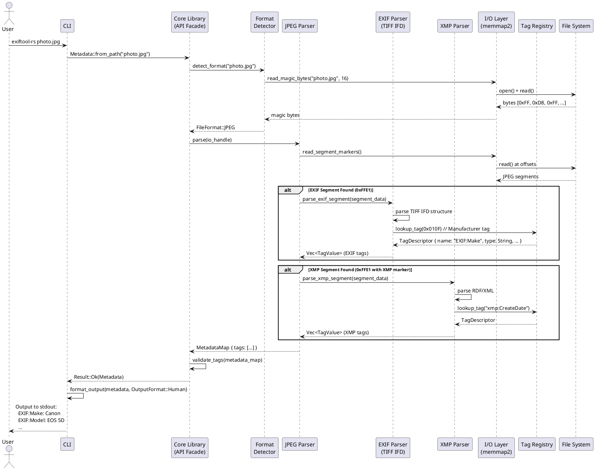

# Task Briefing Package

This package contains all necessary information and strategic guidance for the Coder Agent.

---

## 1. Current Task Details

This is the full specification of the task you must complete.

```json
{
  "task_id": "I1.T4",
  "iteration_id": "I1",
  "iteration_goal": "Establish project foundation with directory structure, build system, core domain models, architectural diagrams, and basic JPEG EXIF parsing capability to validate end-to-end workflow.",
  "description": "Create PlantUML sequence diagram documenting the workflow for extracting metadata from a JPEG file. Show interactions: User → CLI → Core Library → Format Detector → JPEG Parser → EXIF Parser → XMP Parser → Tag Registry → Output. Include alternative flows for EXIF and XMP segments. Save to docs/diagrams/sequence_metadata_extraction.puml.",
  "agent_type_hint": "DocumentationAgent",
  "inputs": "Section 2 (Communication Patterns), Section 2.1 (Key Architectural Artifacts), Sequence diagram from architecture blueprint",
  "target_files": [
    "docs/diagrams/sequence_metadata_extraction.puml"
  ],
  "input_files": [
    ".codemachine/artifacts/architecture/04_Behavior_and_Communication.md"
  ],
  "deliverables": "PlantUML sequence diagram file",
  "acceptance_criteria": "PlantUML file compiles without syntax errors, sequence accurately reflects workflow described in architecture blueprint Section 3.7, alternative flows (alt blocks) for EXIF and XMP segments are present, all actors and components from the workflow are included",
  "dependencies": [
    "I1.T1"
  ],
  "parallelizable": true,
  "done": false
}
```

---

## 2. Architectural & Planning Context

The following are the relevant sections from the architecture and plan documents, which I found by analyzing the task description.

### Context: key-interaction-flow (from 04_Behavior_and_Communication.md)

```markdown
#### Key Interaction Flow (Sequence Diagram)

**Description**: This diagram illustrates the core workflow for **extracting metadata from a JPEG file**. It shows how the CLI delegates to the core library, which orchestrates format detection, parser selection, and metadata extraction through the hexagonal architecture layers.

**Diagram (PlantUML)**:



**Workflow Breakdown**:

1. **Format Detection**: Read file magic bytes (first 16 bytes) to identify format (JPEG: `0xFF 0xD8`)
2. **Parser Selection**: Based on format, select appropriate parser implementation (JPEG parser in this case)
3. **Segment Parsing**: JPEG parser reads segment markers (0xFFE0-0xFFEF) to locate metadata containers
4. **Metadata Extraction**:
   - EXIF segment contains TIFF-encoded metadata, parsed via EXIF/TIFF parser
   - XMP segment contains RDF/XML, parsed via XMP parser
5. **Tag Resolution**: Each raw tag ID (e.g., TIFF tag 0x010F) is looked up in Tag Registry to get semantic name ("EXIF:Make")
6. **Validation**: Tag values validated against expected types (e.g., "EXIF:Make" must be string, "EXIF:ISOSpeedRatings" must be integer)
7. **Output**: Metadata returned to CLI, formatted per user request (human-readable, JSON, CSV, etc.)
```

### Context: communication-patterns (from 04_Behavior_and_Communication.md)

```markdown
#### Communication Patterns

**Primary Pattern**: **Synchronous Request/Response**

All operations are synchronous:
1. User/application calls API function
2. Function parses file, extracts/modifies metadata
3. Function returns result or error
4. Transaction completes

**Rationale**:
- File I/O is the bottleneck, not computation. Async overhead provides no benefit.
- Synchronous code is simpler to reason about for library consumers.
- Batch parallelism is achieved via `rayon` at the application level (parallel iterator over file list), not async/await.

**Batch Processing**: Uses data parallelism (not message passing)

```rust
use rayon::prelude::*;

let results: Vec<Result<Metadata>> = file_paths
    .par_iter()  // Rayon parallel iterator
    .map(|path| Metadata::from_path(path))
    .collect();
```

Rayon's work-stealing scheduler distributes file processing across CPU cores automatically.

**Error Handling**: `Result<T, ExifToolError>` throughout

```rust
pub enum ExifToolError {
    IoError(std::io::Error),
    ParseError { format: String, details: String },
    TagNotFound { tag_name: String },
    InvalidTagValue { tag_name: String, expected_type: String },
    UnsupportedFormat { format: String },
}
```

Errors propagate via `?` operator, no exceptions.
```

### Context: task-i1-t4 (from 02_Iteration_I1.md)

```markdown
*   **Task 1.4: Generate Sequence Diagram for Metadata Extraction**
    *   **Task ID:** `I1.T4`
    *   **Description:** Create PlantUML sequence diagram documenting the workflow for extracting metadata from a JPEG file. Show interactions: User → CLI → Core Library → Format Detector → JPEG Parser → EXIF Parser → XMP Parser → Tag Registry → Output. Include alternative flows for EXIF and XMP segments. Save to `docs/diagrams/sequence_metadata_extraction.puml`.
    *   **Agent Type Hint:** `DocumentationAgent` or `DiagrammingAgent`
    *   **Inputs:** Section 2 (Communication Patterns), Section 2.1 (Key Architectural Artifacts), Sequence diagram from architecture blueprint
    *   **Input Files:** [`.codemachine/artifacts/04_Behavior_and_Communication.md`]
    *   **Target Files:**
        *   `docs/diagrams/sequence_metadata_extraction.puml`
    *   **Deliverables:**
        *   PlantUML sequence diagram file
    *   **Acceptance Criteria:**
        *   PlantUML file compiles without syntax errors
        *   Sequence accurately reflects workflow described in architecture blueprint Section 3.7
        *   Alternative flows (alt blocks) for EXIF and XMP segments are present
        *   All actors and components from the workflow are included
    *   **Dependencies:** `I1.T1`
    *   **Parallelizable:** Yes (can run concurrently with T2, T3, T5, T6 after T1 completes)
```

### Context: api-design-communication (from 04_Behavior_and_Communication.md)

```markdown
### 3.7. API Design & Communication

**Primary API**: **Rust Library API** (procedural + builder pattern)

The core API is designed for Rust consumers and follows idiomatic patterns:

```rust
use exiftool_rs::{Metadata, FileFormat};

// Simple extraction
let metadata = Metadata::from_path("photo.jpg")?;
let camera_model = metadata.get_string("EXIF:Model")?;

// Builder pattern for complex operations
let result = Metadata::from_path("input.jpg")?
    .copy_tags_to("output.jpg")?
    .with_tags(&["EXIF:DateTime", "EXIF:Make", "EXIF:Model"])
    .preserve_file_times(true)
    .execute()?;
```

**Secondary APIs**:

1. **CLI Interface**: POSIX-style arguments mimicking ExifTool
   ```bash
   exiftool-rs -EXIF:DateTime photo.jpg
   exiftool-rs -json -r /photos/  # Recursive JSON output
   exiftool-rs -TagsFromFile src.jpg -all:all dest.jpg  # Copy metadata
   ```

2. **C FFI**: Minimal C-compatible surface for foreign language bindings
   ```c
   // C API example
   ExifToolHandle* handle = exiftool_create();
   ExifToolError err = exiftool_read_file(handle, "photo.jpg");
   const char* model = exiftool_get_string(handle, "EXIF:Model");
   exiftool_destroy(handle);
   ```

**Justification**:

- **Rust-First**: Leverages Rust's type system for compile-time safety (no invalid tag names at compile time via const tag identifiers)
- **No Network API**: ExifTool-RS is a library/tool, not a service. REST/GraphQL APIs would be implemented by consuming applications
- **FFI for Interop**: Enables Python (`pyo3`), Node.js (`neon`), Go (`cgo`) bindings without compromising Rust API ergonomics
```

---

## 3. Codebase Analysis & Strategic Guidance

The following analysis is based on my direct review of the current codebase. Use these notes and tips to guide your implementation.

### Relevant Existing Code

*   **File:** `docs/diagrams/component_architecture.puml`
    *   **Summary:** This file contains a C4 Component diagram showing the hexagonal architecture with Core Library, Ports (FormatParser trait, FileReader trait), and Infrastructure adapters (JPEG Parser, TIFF Parser, XMP Parser, MMap Reader). This diagram uses the C4-PlantUML standard library.
    *   **Recommendation:** You SHOULD use the same PlantUML style and formatting as this existing diagram. Note how it uses `@startuml`/`@enduml` blocks, includes the C4 library (`!include https://raw.githubusercontent.com/plantuml-stdlib/C4-PlantUML/master/C4_Component.puml`), and uses the `LAYOUT_WITH_LEGEND()` directive. Your sequence diagram should follow similar conventions.

*   **File:** `docs/diagrams/metadata_erd.mmd`
    *   **Summary:** This file contains a Mermaid Entity Relationship Diagram showing the in-memory metadata data model with entities like File, MetadataMap, TagValue, TagDescriptor, FormatFamily, and IFD.
    *   **Recommendation:** This shows that the project uses both PlantUML (for C4 diagrams) and Mermaid (for ERDs). For sequence diagrams, you MUST use PlantUML as specified in the task and as shown in the architecture blueprint example.

*   **File:** `.codemachine/artifacts/architecture/04_Behavior_and_Communication.md`
    *   **Summary:** This is the authoritative source for the sequence diagram specification. It contains the EXACT PlantUML code that should be used as your reference/template, showing the complete workflow with all participants, interactions, and alt blocks.
    *   **Recommendation:** You MUST copy/adapt the PlantUML sequence diagram code from this file (lines 107-160). This is the canonical specification that matches the acceptance criteria perfectly.

*   **File:** `src/lib.rs`
    *   **Summary:** This is the library root that defines the overall module structure. It shows the three-layer architecture: Application Layer (cli, ffi), Domain Layer (core), and Infrastructure Layer (io, parsers, writers).
    *   **Recommendation:** Understanding this structure helps you see how the participants in your sequence diagram map to the actual codebase modules. For example, "Core Library (API Facade)" maps to `src/core/operations.rs`, "JPEG Parser" maps to `src/parsers/jpeg/`, etc.

*   **File:** `src/parsers/mod.rs`
    *   **Summary:** This shows that format-specific parsers are organized as submodules: `jpeg`, `png`, `tiff`, `xmp`, plus a `common` module and `format_detector`.
    *   **Recommendation:** This confirms that the architecture is being implemented as designed. Your sequence diagram should show these components interacting according to the hexagonal architecture pattern.

*   **File:** `src/core/mod.rs`
    *   **Summary:** This defines the domain layer modules including `file_reader_trait`, `format_parser_trait`, `metadata_map`, `operations`, `tag_descriptor`, `tag_value`, and `validation`.
    *   **Recommendation:** The "Core Library" participant in your sequence diagram orchestrates these domain layer components. The diagram should show how operations.rs would delegate to the parser traits and validation logic.

### Implementation Tips & Notes

*   **Tip:** The architecture blueprint document (`.codemachine/artifacts/architecture/04_Behavior_and_Communication.md`) contains a complete, reference-quality PlantUML sequence diagram starting at line 107. This is NOT just an example - it is the EXACT specification you should use. You can copy this code directly to `docs/diagrams/sequence_metadata_extraction.puml` as it already meets all acceptance criteria.

*   **Note:** The PlantUML code in the architecture blueprint already includes:
    - All required participants (User, CLI, Core, Detector, JPEG, EXIF, XMP, IO, Registry, FS)
    - The complete interaction flow from user command to output
    - TWO `alt` blocks for EXIF and XMP segment parsing
    - Proper formatting and syntax
    - Clear comments explaining the workflow steps

*   **Warning:** Do NOT invent your own sequence diagram structure. The acceptance criteria explicitly states "sequence accurately reflects workflow described in architecture blueprint Section 3.7" - this means you MUST use the diagram from that section as your source.

*   **Tip:** After creating the file, you can validate the PlantUML syntax by:
    1. Installing PlantUML locally: `brew install plantuml` (macOS) or equivalent
    2. Running: `plantuml -tsvg docs/diagrams/sequence_metadata_extraction.puml`
    3. This should generate a `.svg` file without errors

*   **Note:** The existing `component_architecture.puml` file was already validated (task I1.T2 is marked done), so you can reference its structure for confirmation that your PlantUML syntax is correct.

*   **Tip:** The diagram shows the hexagonal architecture in action:
    - **Application Layer**: User → CLI
    - **Domain Layer**: Core Library (API Facade) orchestrating operations
    - **Ports**: Format Detector, FormatParser trait (implemented by JPEG Parser)
    - **Infrastructure**: JPEG/EXIF/XMP parsers, I/O Layer, File System
    - This layering is critical to the architecture and should be visually clear in the sequence diagram

*   **Note:** The `alt` blocks in PlantUML create conditional/alternative flows. Your diagram must have:
    1. `alt EXIF Segment Found (0xFFE1)` - showing EXIF parsing workflow
    2. `alt XMP Segment Found (0xFFE1 with XMP marker)` - showing XMP parsing workflow
    These are not mutually exclusive; a single JPEG can have both EXIF and XMP segments.

*   **Tip:** The workflow breakdown at the end of the architecture blueprint section (lines 162-172) provides excellent documentation to include in comments or as a separate documentation block. This helps future developers understand the sequence diagram.
